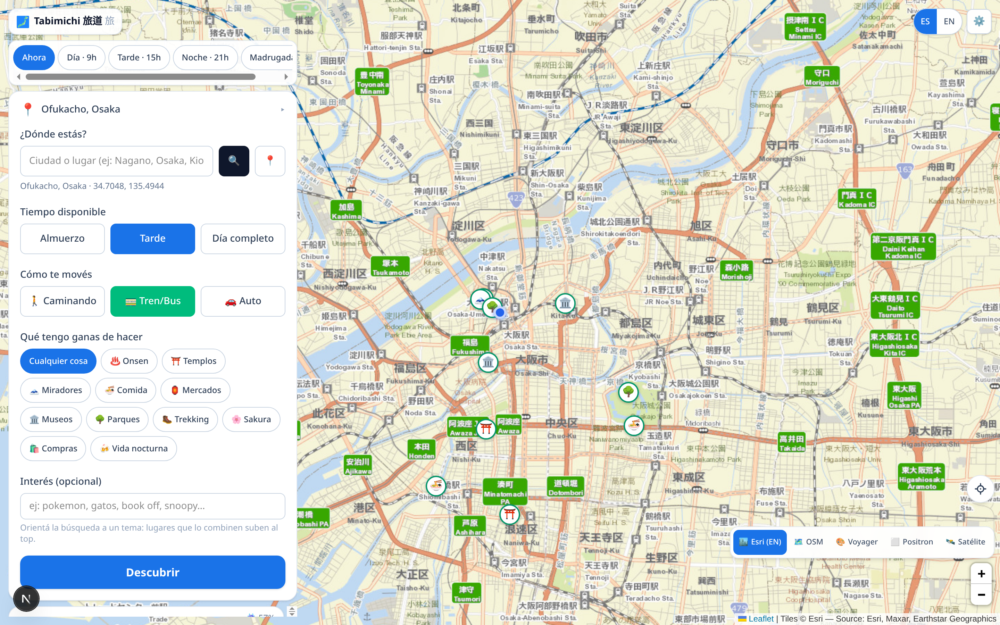
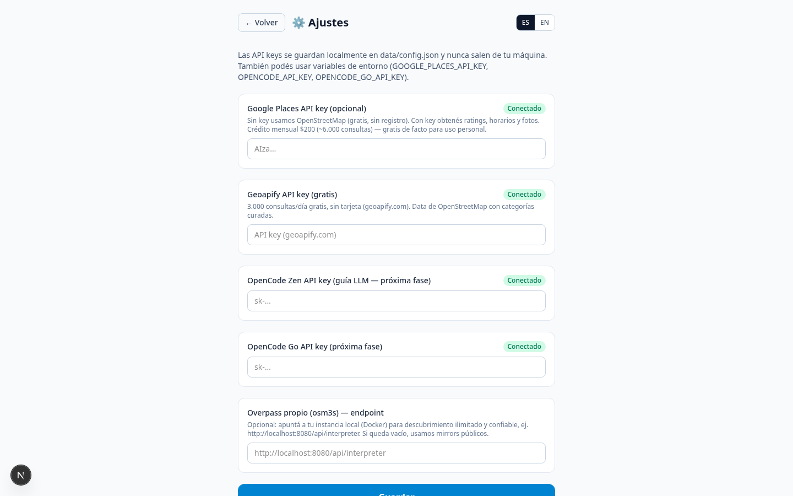
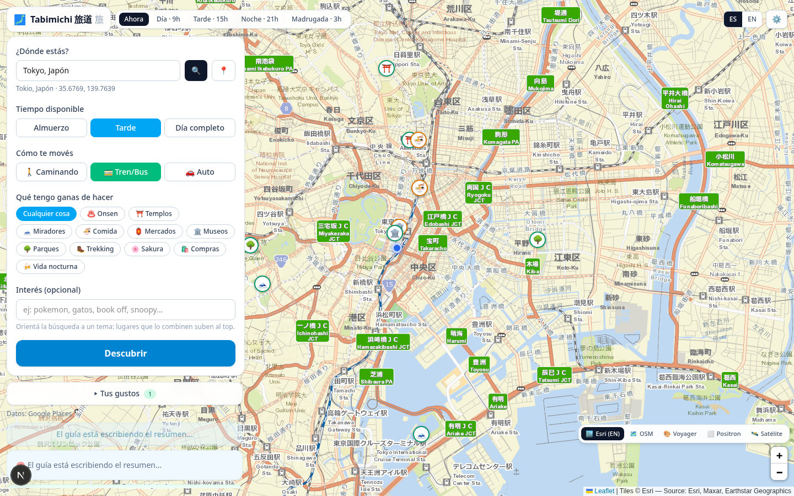
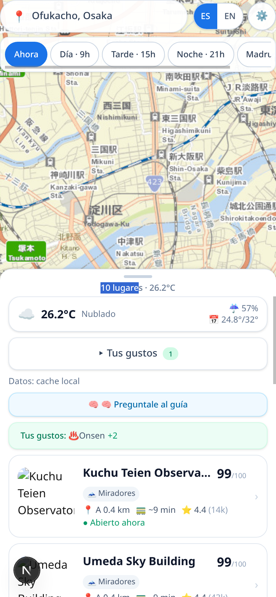

<div align="center">

# 🗾 Tabimichi 旅道

### *Discover what to do today*

A local discovery app that recommends nearby places ranked by **weather**, **distance**, **time budget** and your **mood**.

<br/>

[](https://nextjs.org)
[](https://www.typescriptlang.org)
[](https://react.dev)
[](https://tailwindcss.com)

[](https://leafletjs.com)
[](https://nodejs.org)
[](https://vitest.dev)
[](https://developers.google.com/maps/documentation/places/web-service)
[](https://overpass-api.de)
[](https://open-meteo.com)
[](https://deepseek.com)
[](https://github.com/deepseek-ai/DeepSeek-Harness)

<br/>



*Nearby places ranked by weather, distance, and your mood — with interactive map*

<br/>

> **Status:** `M3 done` · `M4 next` · `M5 planned`
>
> Discovery + weather + scoring + map + LLM narrative + feedback profile — running locally.

</div>

---

## 🚀 Quick start

```bash
npm install
npm run dev        # http://localhost:3000
```

**Requirements:** Node.js ≥ 22.5 (for built-in `node:sqlite`)

### 🚀 Deploy to Vercel

```bash
bash scripts/setup-vercel.sh   # guided setup (login + env vars)
```

Or manually:

```bash
vercel link                      # link to your Vercel account
vercel env add GOOGLE_PLACES_API_KEY production
# ... add other keys
vercel --prod                    # deploy to production
```

**Security:** API keys live on Vercel's servers only — they never reach the browser. Preview deploys are created automatically for every PR.

### 🔐 Multi-user API keys (Supabase)

Each user manages their own API keys — no shared keys, no admin burden.

1. **Create a free Supabase project:** [supabase.com](https://supabase.com) → New Project
2. **Run the migration:** paste `supabase/migrations/001_api_keys.sql` in SQL Editor
3. **Add env vars to Vercel:**

| Variable | Where to find it |
|----------|------------------|
| `NEXT_PUBLIC_SUPABASE_URL` | Supabase → Settings → API → Project URL |
| `NEXT_PUBLIC_SUPABASE_ANON_KEY` | Supabase → Settings → API → anon public |
| `SUPABASE_URL` | Same as above |
| `SUPABASE_ANON_KEY` | Same as above |
| `SUPABASE_SERVICE_ROLE_KEY` | Supabase → Settings → API → service_role (secret) |

4. **Done.** Users sign up in the app → manage their own keys → keys stored per-user with RLS isolation.

### 🔑 API keys (per-user)

Each user configures their own keys in ⚙️ Settings. Keys are stored in Supabase with Row Level Security — only the owner can access them.

| Service | Purpose | Cost |
|---------|---------|------|
| Google Places | Ratings, hours, photos | Free $200/mo credit |
| Geoapify | Backup discovery source | Free 3k req/day |
| Overpass | `OVERPASS_ENDPOINT` | Your own osm3s Docker | Free / self-hosted |
| OpenCode Zen | `OPENCODE_API_KEY` | LLM guide (free tier) | Free |
| OpenCode Go | `OPENCODE_GO_API_KEY` | LLM guide (paid tier) | Pay-per-use |

Open **⚙️ Ajustes** in the app or edit `data/config.json` directly (gitignored).

<div align="center">
  
</div>

---

## ⚙️ How it works

```
         ┌─────────────────────────────────────┐
         │  📍 Where are you?                  │
         │  ⏱️  How much time?                  │
         │  🚃 How will you get around?         │
         │  🎭 What's your mood?                │
         └───────────────┬─────────────────────┘
                         │
                         ▼
         ┌─────────────────────────────────────┐
         │    /api/recommend   ⚡ ~1 second    │
         │  ┌─────────┐  ┌─────────────────┐   │
         │  │ Weather  │  │   Discovery     │   │
         │  │ (parallel)│  │ (4 sources)    │   │
         │  └────┬─────┘  └───────┬────────┘   │
         │       └────────┬───────┘            │
         │                ▼                    │
         │         Rule Scoring                │
         │         (0–100 points)              │
         └───────────────┬─────────────────────┘
                         │
            ┌────────────┴────────────┐
            ▼                         ▼
    ┌───────────────┐      ┌─────────────────────┐
    │  🃏 Cards +   │      │  🧠 /api/narrate    │
    │  🗺️  Map       │      │  (async, on-demand) │
    │  instantly     │      │  LLM writes "why"   │
    └───────────────┘      └─────────────────────┘
```

**Two-phase latency design:** the rules pipeline responds in ~1s and renders cards immediately. The LLM narrative runs separately and fills in when ready. Repeated queries hit freshness caches:

| Cache | TTL | Notes |
|-------|-----|-------|
| 🌤️ Weather | 10 min | Per ~1 km area |
| 📍 Discovery | 15 min | Only when all requested types are covered |
| ⏱️ Overpass hard budget | 30 s | Prevents hanging requests |

---

## 🌐 Discovery sources

Places are discovered live from multiple sources, tried in priority order:

```
  ┌──────────────┐     ┌──────────────┐     ┌──────────────┐     ┌──────────────┐
  │   Google     │ ──▶ │   Geoapify   │ ──▶ │   Overpass   │ ──▶ │   SQLite     │
  │   Places     │     │              │     │   (OSM)      │     │   Cache      │
  │   ✅ Key     │     │   ✅ Key     │     │   ❌ Free    │     │   ❌ Local   │
  └──────────────┘     └──────────────┘     └──────────────┘     └──────────────┘
       Primary              Backup              Fallback           Last resort
```

Results are always cached for resilience. The app degrades gracefully with a clear message when no source is available.

---

## 📊 Scoring engine

Each place receives a **base fit score (0–100)** based on multiple signals:

| Signal | Weight | Description |
|--------|:------:|-------------|
| 🚶 Travel time | `+3 to +18` | Graduated by minutes (≤5 min = max bonus) |
| 🌧️ Weather fit | `−28 to +15` | Indoor boost in rain/snow, outdoor penalty |
| ⭐ Bayesian rating | `−4 to +16` | Shrunk by review count (4.5★ with 5 reviews ≈ 4.0) |
| 📈 Review volume | `+1 to +6` | Capped popularity boost (5k+ reviews = max) |
| 🟢 Open now | `+6 / −15` | Bonus for open, penalty for closed |
| 🎯 Keyword match | `+20` | User intent wins over noise rules |
| 🏪 Chain/hotel penalty | `−12` | Ubiquitous chains are noise (skipped if keyword matched) |
| ❤️ Profile affinity | `−12 to +12` | Learned from 👍/👎 feedback (M3) |

---

## 🚃 Transport modes

Walking / transit / car changes everything — radius, travel times, and reasons:

<div align="center">

| | 🚶 Walking | 🚃 Transit | 🚗 Car |
|--|:----------:|:----------:|:------:|
| **Radius** | 0.4× | 1.0× | 2.0× |
| **Speed** | 4.5 km/h | ~28 km/h | ~40 km/h |
| **Overhead** | — | +8 min wait | +2 min |
| **Rain penalty** | +10 | — | — |

</div>

---

## 🎯 Interest keywords

Optional free-text search for specific brands, themes, or interests:

- **English/Japanese:** "pokemon", "book off", "スターバックス" — Google uses them directly
- **Spanish:** "gatos", "café" — auto-translated via MyMemory API (~300ms first call, cached)
- **Matching places** get `+20` score boost and chain/hotel penalties are waived

---

## ✨ Features

<div align="center">
  
  <br/>
  <em>On-demand LLM guide writes a "why go today" summary</em>
</div>

<br/>

| Feature | Description |
|---------|-------------|
| 🔍 **Multi-source discovery** | Google Places → Geoapify → Overpass → SQLite cache, automatic fallback |
| 🌤️ **Weather-aware scoring** | Open-Meteo forecast drives indoor/outdoor preferences |
| 🚃 **Transport modes** | Walking, transit, car — affects radius, travel times, and reasons |
| 🎯 **Interest keywords** | Search for specific brands, themes, or interests |
| 🧠 **LLM narrative** | Two-tier provider (free → paid) writes day summaries and per-place "why" |
| 📸 **Photo gallery** | Up to 8 photos per place via Place Details, async enrichment |
| 👍 **Feedback loop** | 👍/👎 per card → learned profile → weighted scoring |
| ⚙️ **Tus gustos** | Manual profile manager (−5..+5 steppers per experience type) |
| ⏰ **Time simulation** | Simulate discovery at any hour (JST-aware) |
| 🌐 **i18n** | Spanish / English (built-in dictionaries) |
| 📱 **Responsive** | Works on desktop and mobile |

<div align="center">
  
  <br/>
  <em>Responsive design for on-the-go use</em>
</div>

---

## 📁 Project layout

```
src/
├── app/
│   ├── api/
│   │   ├── recommend/      # Discovery + scoring pipeline
│   │   ├── narrate/        # LLM narrative (async phase 2)
│   │   ├── photos/         # Photo enrichment (async)
│   │   ├── feedback/       # 👍/👎 → profile update
│   │   ├── profile/        # Tus gustos (manual weights)
│   │   ├── geocode/        # Location search
│   │   ├── settings/       # API key management
│   │   └── logs/           # Request tracing
│   ├── page.tsx            # Main UI (map + cards)
│   └── settings/page.tsx   # Settings form
├── components/
│   ├── MapView.tsx         # Leaflet map with markers
│   ├── DayPanel.tsx        # Search + filters panel
│   ├── RecommendationCard.tsx  # Place card with gallery
│   ├── WeatherCard.tsx     # Weather display
│   └── SettingsForm.tsx    # API key form
└── lib/
    ├── recommend.ts        # End-to-end pipeline
    ├── scoring.ts          # Rule-based scoring engine
    ├── weather.ts          # Open-Meteo client
    ├── geo.ts              # Haversine + travel time
    ├── db.ts               # node:sqlite cache + profile
    ├── i18n.tsx            # ES/EN dictionaries
    ├── types.ts            # Shared TypeScript types
    ├── llm/                # Provider registry + narrate()
    ├── places/             # Google/Geoapify/Overpass adapters
    ├── keywords.ts         # Keyword normalization + matching
    ├── translate.ts        # MyMemory translation API
    ├── photos.ts           # Photo proxy + disk cache
    ├── open-hours.ts       # Opening hours evaluation
    ├── jst.ts              # JST timezone helpers
    └── settings.ts         # Local key storage
```

---

## 🧪 Testing

```bash
npm test              # Unit + integration (Vitest)
npm test:watch        # TDD mode
npm run test:e2e      # E2E smoke tests (needs live server)
```

| Layer | Location | Coverage |
|-------|----------|----------|
| **Unit** | `src/lib/*.test.ts` | Geo, scoring, weather, keywords, LLM retry, place sources, DB |
| **Integration** | `src/app/api/routes.test.ts` | All API routes with mocked fetch |
| **E2E** | `scripts/smoke-e2e.mjs` | Real server, real network |

Every request is **traced end-to-end** via `traceId` and persisted as JSON Lines in `data/logs/requests.jsonl`. Inspect with:

```bash
GET /api/logs?tail=N          # Recent entries
GET /api/logs?trace=tr_...    # Full request journey
```

**Testability hooks:** `TABI_DATA_DIR` env / `setDataDir()` / `setConfigPath()` / `setPhotoDir()` / `clearWeatherCache()` — tests run in temp dirs and never touch real data or API keys.

---

## 🗺️ Roadmap

```
  M1 ✅          M2 ✅          M3 ✅          M4 🔜          M5 📋
    │              │              │              │              │
    ▼              ▼              ▼              ▼              ▼
┌────────┐   ┌────────┐   ┌────────┐   ┌────────┐   ┌────────┐
│Foundation│   │ Transport│   │ Feedback│   │ Onboard │   │ Mobile │
│Discovery│   │ + LLM    │   │ + Profile│   │ + Season│   │ + PWA  │
│Weather  │   │ Narrative│   │ Learning│   │ Layers  │   │        │
│Scoring  │   │          │   │          │   │         │   │        │
│Map      │   │          │   │          │   │         │   │        │
└────────┘   └────────┘   └────────┘   └────────┘   └────────┘
```

---

## 📄 License

**Proprietary.** The repository is public for viewing, but all rights are reserved — the code may not be copied, modified, redistributed or used without written permission. See [LICENSE](LICENSE).

---

<div align="center">

*Built for a personal trip, but designed as a generic discovery tool — usable in any city, on any trip.*

🇯🇵 旅道 — *The road of the journey*

</div>
